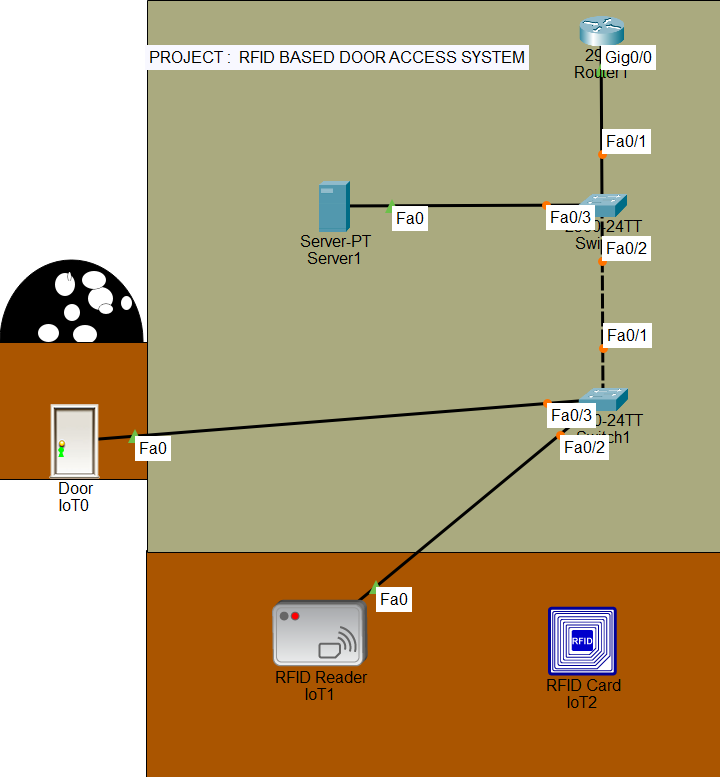

# 🚪 RFID-Based Door Access System

An advanced, network-integrated **Smart Security Solution** developed using **Cisco Packet Tracer** and **IoT Automation**. This project simulates an automated environment where physical access control is managed via RFID authentication and centralized network policies.

---

## 📌 Overview

The **RFID Based Door Access System** leverages physical computing and network simulation to manage secure facility entrance. By utilizing specialized IoT rules on a centralized server, the system automatically authenticates user credentials to lock or unlock a smart door, demonstrating a practical implementation of modern network security and enterprise automation.

---

## ⚡ Features

* **🔒 Secure Authentication:** Multi-device RFID card verification system.
* **🤖 Real-time Automation:** Instantaneous server-driven door action based on event triggers.
* **🌐 Network Services:** Integrated Dynamic Host Configuration Protocol (DHCP) for dynamic IP provisioning.
* **📊 Event Logging:** Centrally managed access tracking on the IoT server.
* **🛡️ Robust Access Control:** Strict validation rules preventing unauthorized hardware overrides.

---

## 🛠️ Technologies & Tools

* **Cisco Packet Tracer:** Network environment design, configuration, and simulation.
* **IoT Programming & Server Rules:** Logic deployment for hardware automation.
* **Networking Protocols:** IPv4 Addressing, Subnetting, and DHCP services.

---

## 🏗️ System Architecture & Devices

The simulated infrastructure comprises the following enterprise-grade network and smart components:

* **1 x Core Router:** Handles network routing and acts as the central gateway.
* **2 x LAN Switches:** Facilitates high-speed local data transport between endpoints.
* **1 x Registration Server (IoT Server):** The brains of the operation, processing authentication logic.
* **1 x RFID Reader:** Edge device that scans signals and sends physical payloads over IP.
* **Smart Door Components:** Actuators including the **Smart Door** itself and the electronic **RFID Cards**.

---

## 🗺️ Network Topology & Output

### 🔁 The Workflow
1. **Scanning Phase:** A user scans an RFID Card at the RFID Reader.
2. **Data Transmission:** The reader packages the payload and transmits it over the local network to the **IoT Server**.
3. **Verification Logic:** The server evaluates the payload against its access control database.
4. **Action Trigger:** * If **Valid** $\rightarrow$ Server sends a command signal to change the status of the **Smart Door** to *Unlocked*.
   * If **Invalid** $\rightarrow$ The **Smart Door** remains securely *Locked*, and an alert state can be monitored.

---

## 📋 Network Configuration & IP Schema

| Device Component | Interface | IP Address | Subnet Mask | Default Gateway |
| :--- | :--- | :--- | :--- | :--- |
| **Router (R1)** | GigabitEthernet | `192.168.1.1` | `255.255.255.0` | *N/A* |
| **IoT Server** | FastEthernet | `192.168.1.51` | `255.255.255.0` | `192.168.1.1` |
| **Network Range**| Broadcast Domain| `192.168.1.0/24`| *Class C Standard* | *N/A* |

---

## ⚙️ Automation Rules Configuration

The server evaluates access control permissions based on the following deterministic logical rulesets:

| Rule Name | Trigger Condition | Target Device | Output Action |
| :--- | :--- | :--- | :--- |
| **Access Granted** | Valid RFID Card ID Detected | Smart Door | `Lock Status = False (Open)` |
| **Access Denied** | Invalid / Unknown Card ID | Smart Door | `Lock Status = True (Closed)` |

---

## 🚀 Advantages

* **Enhanced Security:** Eradicates standard mechanical lock vulnerabilities.
* **High Efficiency:** Near-zero latency processing between access requests and hardware responses.
* **Scalability:** The architecture allows for easy provisioning of additional switches, readers, or servers.
* **Centralized Administration:** Access control lists (ACLs) can be modified from a single server console without hardware rewires.

---

## 🔮 Future Enhancements

* **Multi-Factor Authentication (MFA):** Integrating biometric layers like fingerprint or facial recognition alongside RFID.
* **Cloud Architecture Integration:** Mirroring local IoT events to cloud dashboards for remote system telemetry.
* **Mobile Client App:** Allowing administrators to lock/unlock zones via an API endpoint.
* **AI Threat Mitigation:** Recognizing access anomalies (e.g., rapid credential brute-forcing) using intelligent scripts.

---

## 👤 Author

* **Husnain Raheem** - *Network & IoT Enthusiast* - [@Nain-007sh](https://github.com/Nain-007sh)

---
*Developed for training and simulation purposes in Cisco Packet Tracer.*
